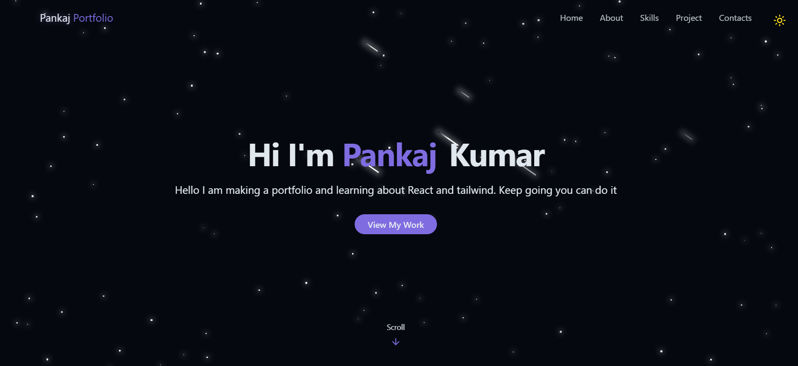

# 💼 Portfolio Website

This is my personal **developer portfolio** built with **React** and **Tailwind CSS**, showcasing my projects, skills, and contact information.

## 🚀 Tech Stack

- ⚛️ React.js  
- 💨 Tailwind CSS  
- 🌐 HTML5 & CSS3  
- ⚡ Vite  
- 📁 Deployed via GitHub Pages / Vercel / Netlify *(configure as needed)*

## 🌐 Live Demo

🔗 [View Portfolio](https://jaspPankaj.github.io/portfolio/)


## 📸 Screenshots



## 🧩 Features

- Responsive and modern design
- Featured project cards with images and tags
- Hover animations and transitions
- Dark mode toggle (optional)
- Clean and maintainable code structure
- Reusable components

## 📁 Folder Structure

portfolio/
├── public/
│ └── projects/
├── src/
│ ├── components/
│ ├── pages/
│ ├── assets/
│ └── App.jsx
├── tailwind.config.js
└── vite.config.js


## 🛠️ Getting Started

To run this project locally:

```bash
# Clone the repository
git clone https://github.com/jaspPankaj/portfolio.git

# Navigate into the project directory
cd portfolio

# Install dependencies
npm install

# Start the development server
npm run dev

🙋‍♂️ Author
Pankaj Kumar
[GitHub](https://github.com/jaspPankaj)  
[LinkedIn](https://www.linkedin.com/in/pankaj-kumar-123456789/)

📄 License
This project is licensed under the MIT License.